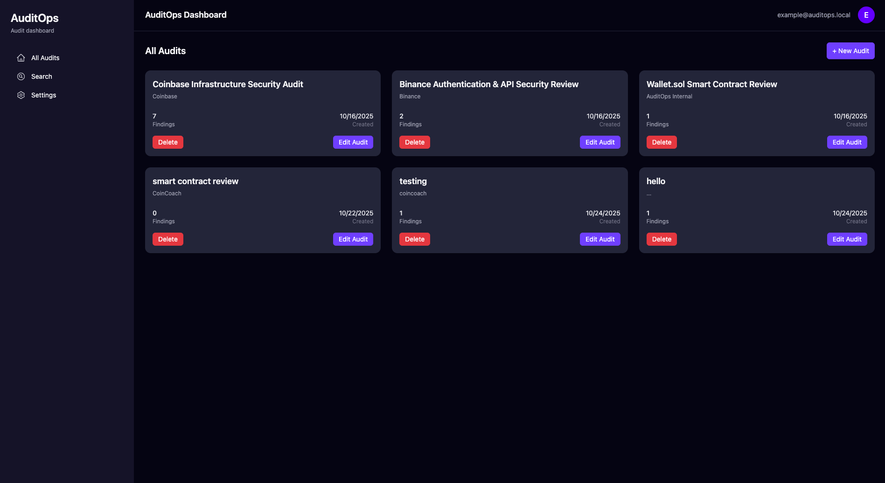

# AuditOps Frontend

This is the frontend for **AuditOps**, a modern audit management platform that allows users to create, manage, and export audit findings. Built with **React**, **Vite**, and **TypeScript**, it provides a fast, responsive, and intuitive interface for managing audits.

## Features

- Dashboard displaying all audits with counts of findings
- Create, edit, and delete audits
- View audit details and manage findings
- Export audit findings to PDF
- Modern UI built with Tailwind CSS
- API integration with the Node.js backend

---

### Dashboard View


### Audit Details View


## Tech Stack

- React (with Vite)
- TypeScript
- Tailwind CSS
- React Router DOM
- Fetch API for backend communication

## Getting Started

### Prerequisites

Ensure you have the following installed:
- Node.js (v18 or later)
- npm or yarn

### Installation

```bash
# Clone the repository
git clone https://github.com/yourusername/auditops-frontend.git
cd auditops-frontend

# Install dependencies
npm install

# Start the development server
npm run dev
```
## APIs

### Audits
| Method | Endpoint      | Description                         |
| ------ | ------------- | ----------------------------------- |
| GET    | `/audits`     | Get all audits with findings count  |
| GET    | `/audits/:id` | Get a single audit and its findings |
| POST   | `/audits`     | Create a new audit                  |
| POST   | `/audits/:id` | Update an existing audit            |
| DELETE | `/audits/:id` | Delete an audit                     |

### Fidnings
| Method | Endpoint                               | Description       |
| ------ | -------------------------------------- | ----------------- |
| POST   | `/audits/:auditId/findings`            | Add a new finding |
| POST   | `/audits/:auditId/findings/:findingId` | Update a finding  |
| DELETE | `/audits/:auditId/findings/:findingId` | Delete a finding  |

